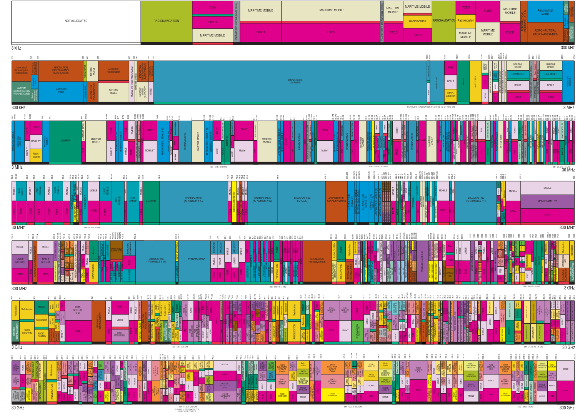

# ISM-Band
<h4>Industrial, Scientific, and Medical Frequenzyband</h4>

---

## Überblick
- Was sind die ISM-Bänder?
  
- Warum wird es benötigt?

- Welche Bereiche gibt es?

- Länderspezifisches

---

## Geschichte

- Ein System zur Verteilung frei nutzbarer Frequenzbereiche.

- 1985 von der Federal Communications Commission eingeführt.

- Wurde für unvermeidbare Emmissionen in Industriellen Andwendung reserviert.

- Heutzutage von unzähliger Weise verwendet (Garagen Öffner, Mikrowellen, WLAN, RFID, ...)  

<a style="font-size: 15px; position: absolute; bottom: 0px;" href="http://www.signalpro.biz/ismband.pdf">Quelle: Signalpro.biz</a>

---

 ## Bereiche

<a style="font-size: 15px; position: absolute; bottom: 0px;" href="https://slideplayer.com/slide/6673407/">Quelle: Kerry Lyons SlidePLayer.com </a>

---

### Eigenheiten

- Lizensfrei nutzbar

- dürfen 10mW Sendeleistung nicht überschreiten

- Anfällig für Störungen

- Historisch geprägtes System

---

---
### Was ist das?
Ein System zur Verteilung frei nutzbarer Frequenzbereiche.

ISM-Band

---
### Geschichte dahinter

