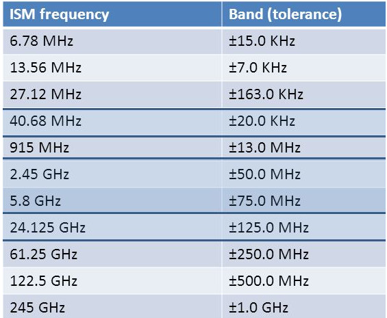

# ISM-Band
<h4>Industrial, Scientific, and Medical Frequenzyband</h4>

---

## Überblick
- Was ist das ISM-Band?
  
- Warum wird es benötigt?

- Welche Bereiche gibt es?

- Länderspezifisches

---

### Eigenheiten

- Lizensfrei nutzbar

- dürfen 10mW Sendeleistung nicht überschreiten

- in den am meisten genutzen kommt es oft zu Störungen.

---

 ## Bereiche

<a style="font-size: 15px; position: absolute; bottom: 0px;" src="https://slideplayer.com/slide/6673407/">Quelle: Kerry Lyons SlidePLayer.com </a>

---

---
### Was ist das?
Ein System zur Verteilung frei nutzbarer Frequenzbereiche.

ISM-Band

---
### Geschichte dahinter

